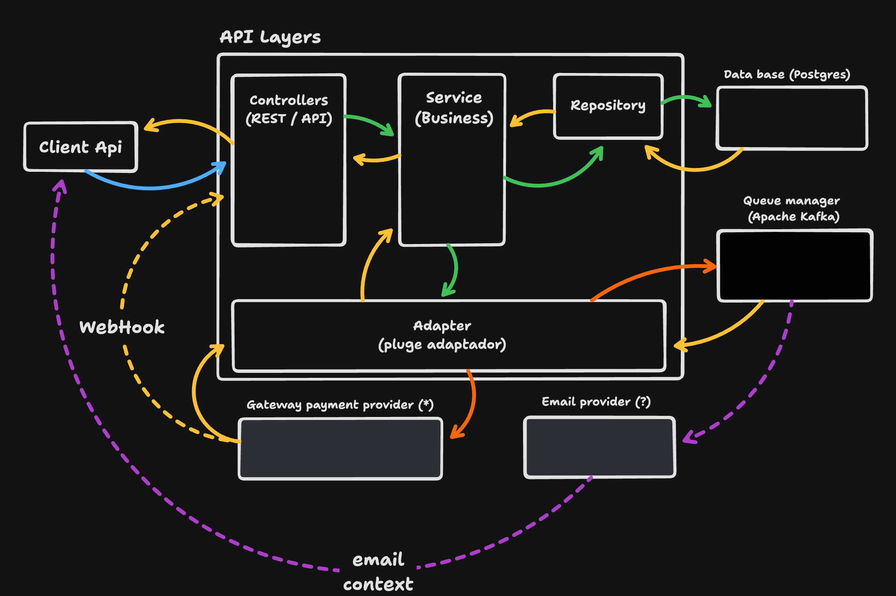

# Architecture - [(Voltar ao README)](../README.md)

Este diagrama de arquitetura representa a estrutura do sistema de venda de ingressos. 
Como podem observar existem 2 pontos de comunicação externa do projeto:
- Repository: Representa a comunicação com o banco de dados, podendo ele ser na mesma infra ou em uma externa.
- Adapter: Representa a comunicação com sistemas externos, como por exemplo, um gateway de pagamento, e comunicação com o orquestrador de fila.
Podemos verificar que apesar de apenas 1 entrada de comunicação, podemos distinguir em 2 formatos:
- API: Representa a comunicação com o cliente, seja ele um usuário final ou um sistema externo.
- Hook: Representa a comunicação com sistemas externos, como por exemplo, um gateway de pagamento, e comunicação com o orquestrador de fila.
Assim podemos utilizar validações de segurança e autorização de acesso de forma separada para cada tipo de comunicação.
Nele estão representados os componentes principais do sistema e suas interações.
Este diagrama foi criado a partir do site [tldraw](https://tldraw.com/).
O arquvio original para edições pode ser encontrado clicando [aqui](./bkp-design/architecture-layers.tldr).
Importe o arquivo no site para visualizar e editar, depois exporte para imagem e substitua a imagem atual.

---

