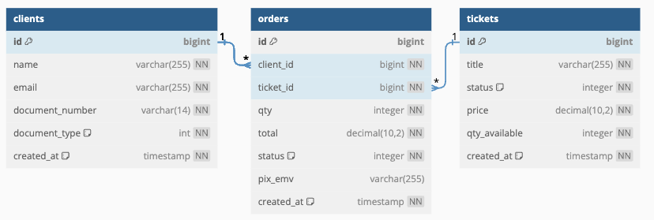

# Database - [(Voltar ao README)](../README.md)

Estas são as que serão mantidas para atender as funcionalidades do sistema de venda de ingressos.
Este diagrama foi criado a partir do site [dbdiagram.io](https://dbdiagram.io/).

<details>
  <summary>Code diagram</summary>

  ```markdown

// Use DBML to define your database structure
// Docs: https://dbml.dbdiagram.io/docs

Table clients {
  id integer [primary key]
  name varchar2
  email varchar2
  document_number varchar
  document_type int [note: '1 = PF, 2 = PJ']
}

Table orders {
  id integer [primary key]
  client_id integer [ref: > clients.id]
  ticket_id integer [ref: > tickets.id]
  qty integer
  data text [note: 'Content of the post']
  status integer [note: '1=created, 2=paid, 3=canceled, 4=expired']
  created_at timestamp
}

Table tickets {
  id integer [primary key]
  title varchar
  status varchar [note: '1=open to sale, 2=closed to sale']
  created_at timestamp
  price decimal
  qty_to_sale integer
}

  ```
  
</details>

---


