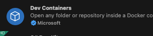
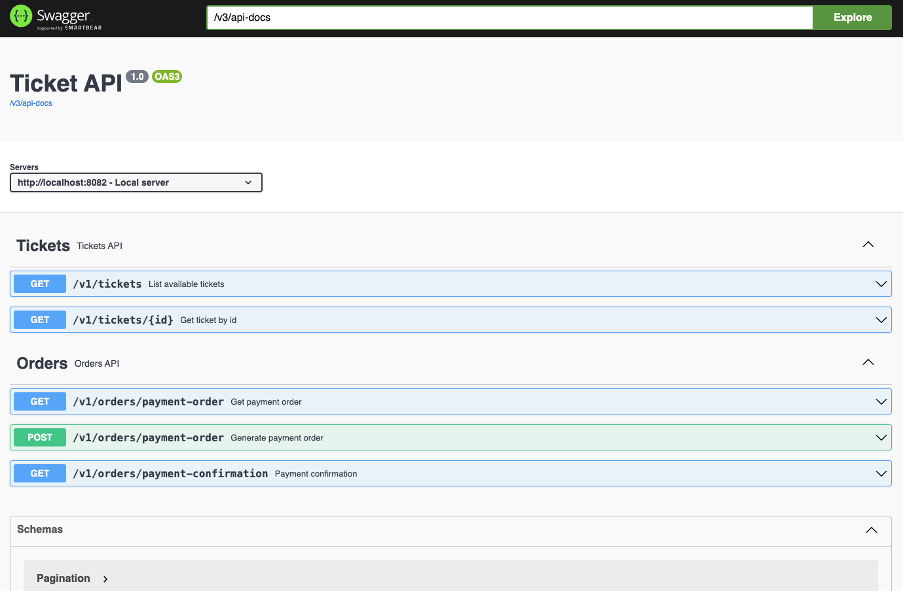
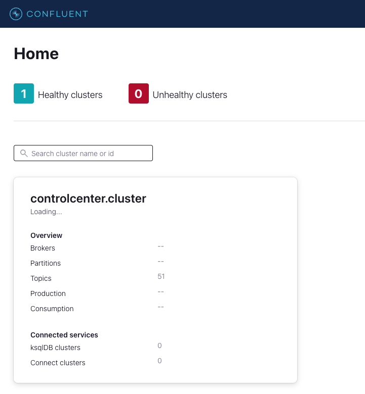
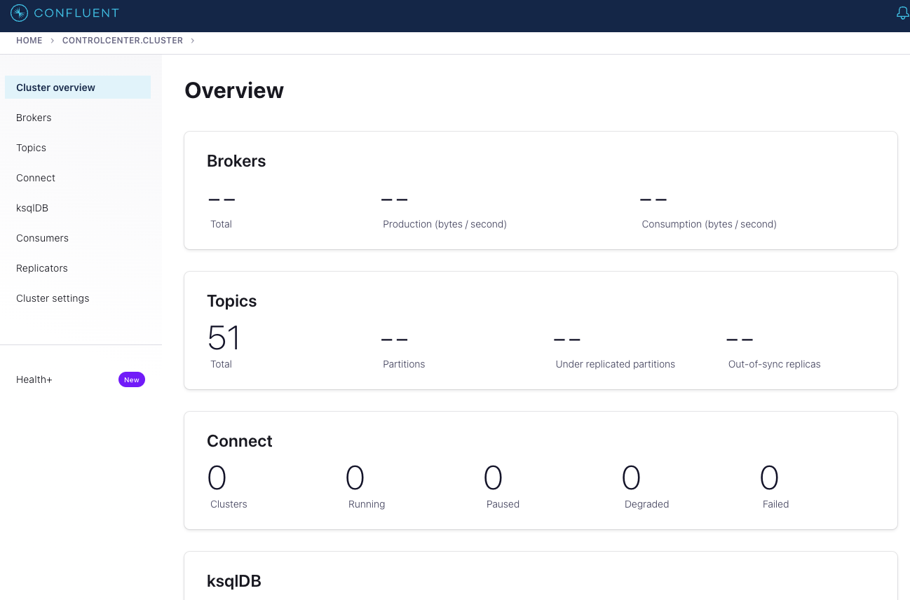

## Ferramentas - [(Voltar ao README)](../README.md)

- [VsCode](https://code.visualstudio.com/download) - Editor de texto ou IDE de sua preferência, a escolha deste tutorial será o VsCode.
- [PosgresSQL](https://www.postgresql.org/download/) - Banco de dados relacional.
- [Java 17](https://www.oracle.com/java/technologies/javase-jdk17-downloads.html) - Linguagem de programação.
- [Maven](https://maven.apache.org/download.cgi) - Gerenciador de dependências.
- [Apache Kafka](https://kafka.apache.org/downloads) - Orquestrador de fila.

Estas são as ferramentas necessárias para rodar o projeto, caso queira rodar o projeto no docker, será necessário instalar o [Docker](https://docs.docker.com/get-docker/) e o [Docker Compose](https://docs.docker.com/compose/install/).

> 📝 **Extra:** Uma dica boa para ter mais performance nas configurações de ambiente e simular o mais próximo o cenário de produção o ``VsCode`` tem uma extensão chamada DevContainer demonstrada na imagem abaixo:
Para saber mais como configurar e utilizar a extensão, acesse a [documentação](https://code.visualstudio.com/docs/remote/containers).

---


## Rodando o projeto - [(Voltar ao README)](../README.md)

No nosso caso, vamos rodar o projeto no docker, então vamos seguir os passos abaixo:

- Clone o projeto para sua máquina.
- Abra o terminal e navegue até a pasta do projeto.
- Abra o projeto no VsCode.
- Se já tiver a extensão DevContainer instalada, o plugin irá perguntar se deseja abrir o projeto na DevContainer, clique em ``Reopen in Container``. Em caso da opçao não aparecer, segue o passo a passo para configurar a DevContainer:
  - Clique no ícone de engrenagem no canto inferior esquerdo do VsCode.
  - Clique na opção ``Remote-Containers: Reopen in Container``.

Este comando irá abrir o projeto no container do docker, com todas as ferramentas necessárias para rodar o projeto. Caso não tenha a extensão DevContainer, siga os passos abaixo:
  - Após seguir os passos acima até abrir o projeto no VsCode, abra o terminal e digite o comando ``docker-compose up`` para subir o banco de dados, orquestrador de fila e outras ferramentas necessárias para o desenvolvimento.
  - Após subir o docker, abra o terminal e digite o comando ``mvn clean install`` para instalar as dependências do projeto.
  - Após instalar as dependências, digite o comando ``mvn spring-boot:run`` para subir a aplicação.

Tanto na primeira opção quanto na segunda, a aplicação estará rodando e pronta para ser utilizada. Acesse a documentação da API no endereço ``http://localhost:<PORT>/swagger-ui.html``. O ``<PORT>`` é a porta que a aplicação está rodando, por padrão é a porta 8080 ou 8082.


  - **Obs.:** Caso esteja usando a DevContainer, a aplicação já estará rodando e o debug já estará configurado.
  - Para debugar a aplicação, basta clicar no botão de debug do VsCode e selecionar a opção `Attach to Remote JVM`.
  - Se não tiver a opção `Attach to Remote JVM`, basta clicar no botão de debug do VsCode e selecionar a opção `Add Configuration` e adicionar a seguinte configuração:
    ```json
    {
      "type": "java",
      "name": "Attach to Remote JVM",
      "request": "attach",
      "hostName": "localhost",
      "port": 5005
    }
    ```
  - **Obs.:** Lembrando que o debug só funcionará se o address for o mesmo que foi configurado no comando de debug.
- Acessar a documentação da API no endereço `http://localhost:<PORT>/swagger-ui.html`
  - **Obs.:** O `<PORT>` é a porta que a aplicação está rodando, por padrão é a porta 8080 ou 8082.
- Para funcionar o envio de email, é necessário configurar as credenciais, no caso deste código, não voi enviado os valores para um arquivo de propriedades, mas em um projeto real, seria enviado para um arquivo de propriedades ou para um serviço de configuração. Altere o arquivo TicketSaleService.java e coloque as credenciais do email que será utilizado para enviar os emails no Bean `JavaMailSenderImpl`.

Deverá aparecer algo parecido com a imagem abaixo:



## Verificando - [(Voltar ao README)](../README.md)

Para verificar se o banco de dados está rodando, acessar o banco de dados com as seguintes credenciais:
```properties
  - Host:localhost
  - Port:5432
  - User:postgres
  - Password:postgres
```
Para verificar se o orquestrador de fila está rodando, acessar o link [http://localhost:9021](http://localhost:9021).

Deverá aparecer algo parecido com a imagem abaixo:



