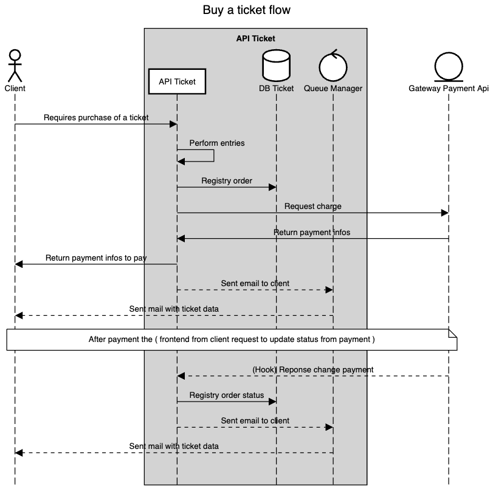

# Sequence Diagram - [(Voltar ao README)](../README.md)

Este diagrama de sequência representa o fluxo principal do sistema de venda de ingressos.
Esse diagrama foi criado a partir do site [sequencediagram.org](https://sequencediagram.org/).

<details>
  <summary>Code diagram</summary>

  ```markdown

  title Buy a ticket flow

  actor Client
  participantgroup #lightgray **API Ticket**
  participant API Ticket
  database DB Ticket
  control Queue Manager
  end
  entity Gateway Payment Api

  Client->API Ticket:Requires purchase of a ticket
  API Ticket->API Ticket:Perform entries
  API Ticket->DB Ticket:Registry order
  API Ticket->Gateway Payment Api:Request charge
  Gateway Payment Api->API Ticket:Return payment infos 
  API Ticket->Client:Return payment infos to pay
  API Ticket-->Queue Manager:Sent email to client
  Queue Manager-->Client:Sent mail with ticket data
  note over Client, Gateway Payment Api:After payment the ( frontend from client request to update status from payment )
  Gateway Payment Api-->API Ticket:(Hook) Reponse change payment
  API Ticket->DB Ticket:Registry order status
  API Ticket-->Queue Manager:Sent email to client
  Queue Manager-->Client:Sent mail with ticket data

  ```
  
</details>

---


